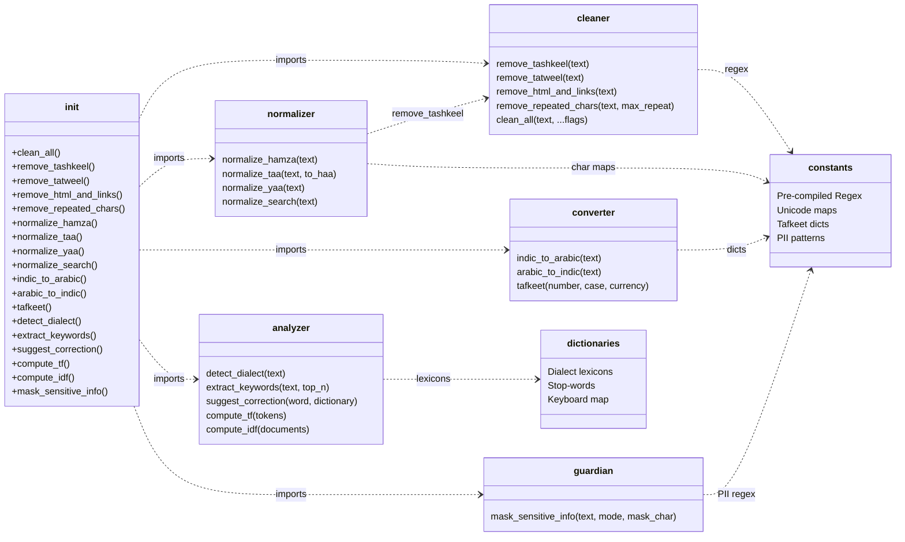
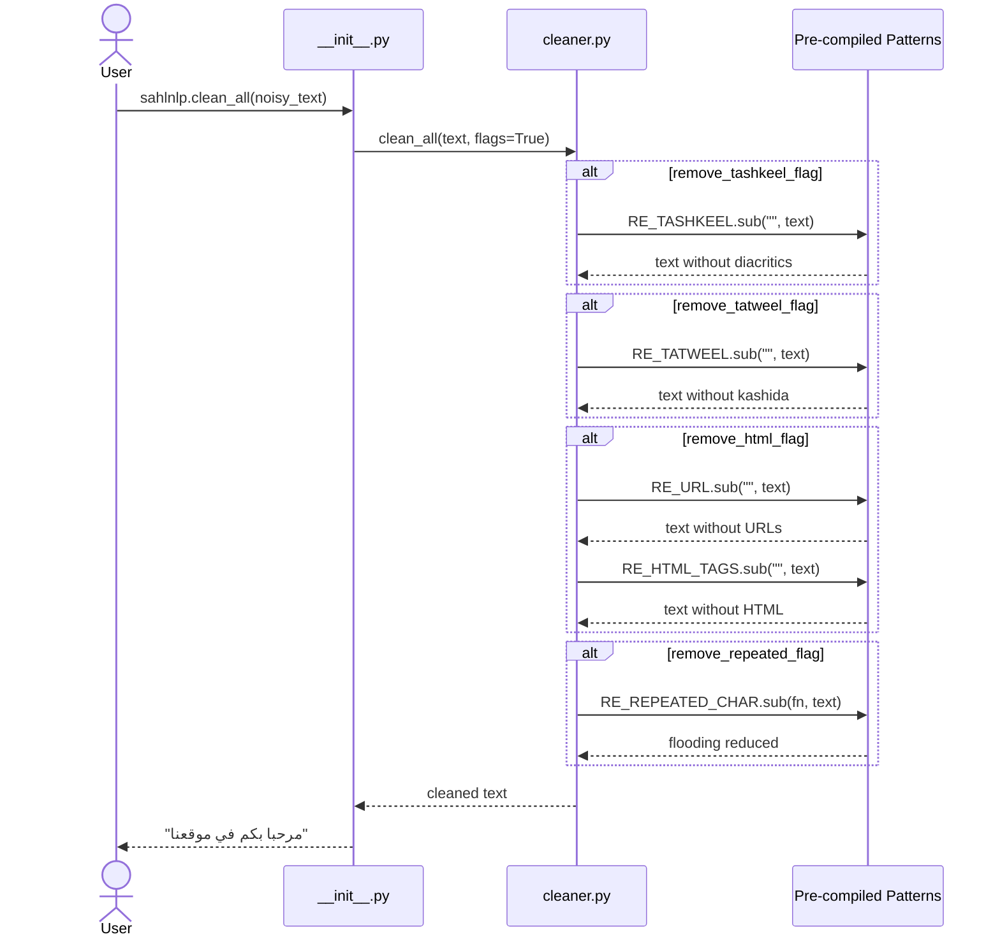
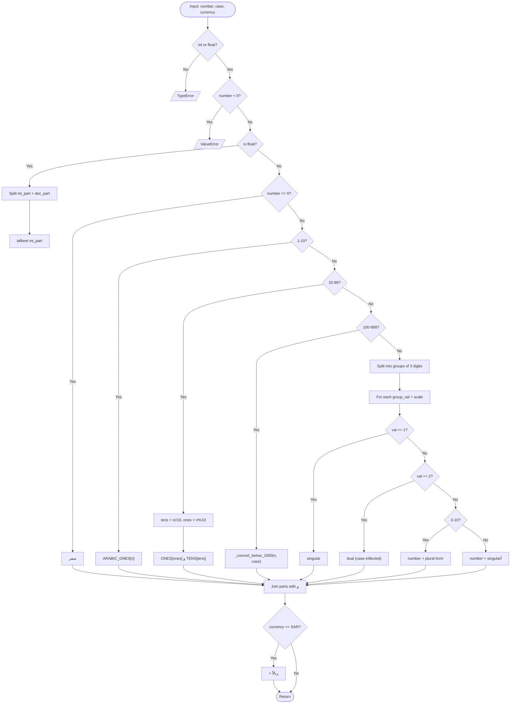
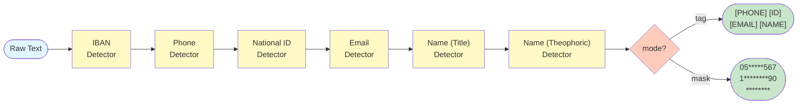

# SahlNLP

> A zero-dependency, ultra-fast Arabic NLP toolkit for text preprocessing, normalization, and analysis.

[](https://www.python.org/downloads/)
[](https://opensource.org/licenses/MIT)
[]()

**SahlNLP** (سهل = easy in Arabic) is a lightweight Python library designed for Arabic text preprocessing, normalization, and advanced analysis. It targets AI engineers and web developers who need a fast, no-overhead solution for handling Arabic text.

---

## Features

- **Zero external dependencies** — only uses Python's built-in standard library
- **High performance** — pre-compiled regex patterns, minimal memory footprint
- **Full type hints** — excellent IDE support and autocompletion
- **Comprehensive** — cleaning, normalization, numeral conversion, number-to-words (tafkeet), dialect detection, keyword extraction, and fuzzy matching
- **Well-tested** — 156 tests with 100% pass rate
- **Advanced algorithms from scratch** — TF-IDF, Levenshtein distance, and weighted dialect classification built with zero external libraries

---

## Installation

```bash
pip install sahlnlp
```

---

## Quick Start

```python
import sahlnlp

# Clean noisy Arabic text
sahlnlp.clean_all("مَرْحَباً بـكـــــم في <b>موقعنا</b> https://example.com")
# => "مرحبا بكم في موقعنا"

# Normalize for search indexing
sahlnlp.normalize_search("أحمد مُعَلِّمٌ في المدرسة")
# => "احمد معلم في المدرسه"

# Convert numbers to Arabic words
sahlnlp.tafkeet(150)
# => "مائة وخمسون"

# Convert Hindi digits to standard numerals
sahlnlp.indic_to_arabic("٣ أبريل ٢٠٢٥")
# => "3 أبريل 2025"

# Detect Arabic dialect (Gulf, Levantine, Egyptian, Maghrebi)
sahlnlp.detect_dialect("شلونك يا خوي")
# => {"Gulf": 1.0, "Levantine": 0.0, "Egyptian": 0.0, "Maghrebi": 0.0}

# Extract keywords using pure-Python TF-IDF
sahlnlp.extract_keywords("الذكاء الاصطناعي فرع مهم. الذكاء الاصطناعي متطور.", top_n=3)
# => [("الاصطناعي", 0.12), ("متطور", 0.10), ("فرع", 0.10)]

# Fuzzy match with Arabic keyboard-aware Levenshtein distance
sahlnlp.suggest_correction("مدرية", ["مدرسة", "مدينة", "مربية"])
# => "مدرسة"
```

---

## Architecture & Data Flow

### Package Structure



### `clean_all()` Execution Sequence



### `tafkeet()` Decision Flow



### Guardian PII Masking Pipeline



---

## API Reference

### Text Cleaning (`sahlnlp.cleaner`)

#### `remove_tashkeel(text)`
Remove all Arabic diacritical marks (tashkeel).

```python
sahlnlp.remove_tashkeel("كِتَاب")
# => "كتاب"
```

#### `remove_tatweel(text)`
Remove tatweel/kashida characters (ـ).

```python
sahlnlp.remove_tatweel("الســــلام")
# => "السلام"
```

#### `remove_html_and_links(text)`
Remove HTML tags and URLs from text.

```python
sahlnlp.remove_html_and_links("زوروا <b>http://example.com</b>")
# => "زوروا "
```

#### `remove_repeated_chars(text, max_repeat=2)`
Reduce character flooding to a maximum number of repetitions.

```python
sahlnlp.remove_repeated_chars("مرحباًاااا")
# => "مرحباًاا"
```

#### `clean_all(text, ...)`
Master cleaning function. Applies all cleaning operations with toggle flags.

```python
sahlnlp.clean_all(
    "مَرْحَباً",
    remove_tashkeel_flag=True,
    remove_tatweel_flag=True,
    remove_html_flag=True,
    remove_repeated_flag=True,
    max_repeat=2,
)
# => "مرحبا"
```

---

### Text Normalization (`sahlnlp.normalizer`)

#### `normalize_hamza(text)`
Convert all Alef variations (أ, إ, آ) to bare Alef (ا).

```python
sahlnlp.normalize_hamza("أحمد إبراهيم آدم")
# => "احمد ابراهيم ادم"
```

#### `normalize_taa(text, to_haa=True)`
Convert Taa Marbuta (ة) to Haa (ه), or vice versa.

```python
sahlnlp.normalize_taa("مدرسة")          # => "مدرسه"
sahlnlp.normalize_taa("مدرسه", to_haa=False)  # => "مدرسة"
```

#### `normalize_yaa(text)`
Convert Alef Maksura (ى) to Yaa (ي).

```python
sahlnlp.normalize_yaa("موسى")
# => "موسي"
```

#### `normalize_search(text)`
Aggressive normalization for search engine indexing. Combines all normalization steps.

```python
sahlnlp.normalize_search("أحمد مُعَلِّمٌ في المدرسة")
# => "احمد معلم في المدرسه"
```

---

### Number Conversion (`sahlnlp.converter`)

#### `indic_to_arabic(text)`
Convert Arabic-Indic digits (٠١٢٣...) to standard numerals (0123...).

```python
sahlnlp.indic_to_arabic("٣ أبريل ٢٠٢٥")
# => "3 أبريل 2025"
```

#### `arabic_to_indic(text)`
Convert standard numerals (0123...) to Arabic-Indic digits (٠١٢٣...).

```python
sahlnlp.arabic_to_indic("3 أبريل 2025")
# => "٣ أبريل ٢٠٢٥"
```

#### `tafkeet(number, case='nominative', currency=None)`
Convert a number to grammatically correct Arabic words with full إعراب support.

```python
sahlnlp.tafkeet(0)        # => "صفر"
sahlnlp.tafkeet(11)       # => "أحد عشر"
sahlnlp.tafkeet(101)      # => "مائة وواحد"
sahlnlp.tafkeet(1011)     # => "ألف وأحد عشر"
sahlnlp.tafkeet(250000)   # => "مائتان وخمسون ألفاً"

# Case inflection (إعراب)
sahlnlp.tafkeet(20, case='nominative')   # => "عشرون" (مرفوع)
sahlnlp.tafkeet(20, case='accusative')   # => "عشرين" (منصوب)
sahlnlp.tafkeet(2000, case='nominative')  # => "ألفان"
sahlnlp.tafkeet(2000, case='accusative')  # => "ألفين"

# Currency (SAR)
sahlnlp.tafkeet(150, currency='SAR')     # => "مائة وخمسون ريالاً"
sahlnlp.tafkeet(1.5, currency='SAR')     # => "واحد ريالاً وخمسة هللة"
```

---

### Advanced Analysis (`sahlnlp.analyzer`) — *Built from scratch, zero dependencies*

#### `detect_dialect(text)`
Detect the most likely Arabic dialect using weighted lexicon-based classification. Supports Gulf, Levantine, Egyptian, and Maghrebi dialects.

```python
sahlnlp.detect_dialect("شلونك يا خوي")
# => {"Gulf": 1.0, "Levantine": 0.0, "Egyptian": 0.0, "Maghrebi": 0.0}

sahlnlp.detect_dialect("عاوز اروح ازاي")
# => {"Gulf": 0.0, "Levantine": 0.0, "Egyptian": 1.0, "Maghrebi": 0.0}
```

#### `extract_keywords(text, top_n=5)`
Extract top keywords using a pure-Python TF-IDF implementation. Splits text on punctuation for IDF calculation and filters Arabic stop-words.

```python
sahlnlp.extract_keywords("الذكاء الاصطناعي فرع من علوم الحاسوب. الذكاء مهم.", top_n=3)
# => [("الحاسوب", ...), ("علوم", ...), ("الاصطناعي", ...)]
```

#### `suggest_correction(word, dictionary, use_keyboard=True)`
Find the closest matching word using Levenshtein distance with optional Arabic keyboard proximity penalties (adjacent keys get reduced substitution cost).

```python
sahlnlp.suggest_correction("مدرية", ["مدرسة", "مدينة", "مربية"])
# => "مدرسة"

sahlnlp.suggest_correction("مكتية", ["مكتبة", "مكتب", "مكية"])
# => "مكتبة"
```

#### `compute_tf(tokens)` / `compute_idf(documents)`
Lower-level TF and IDF functions for custom pipelines.

```python
from sahlnlp import compute_tf, compute_idf

tf = compute_tf(["كتاب", "كتاب", "قلم"])   # {"كتاب": 0.667, "قلم": 0.333}
idf = compute_idf([["كتاب", "قلم"], ["كتاب", "حبر"]])
```

---

## Development

```bash
# Clone the repository
git clone https://github.com/your-username/SahlNLP.git
cd SahlNLP

# Install in development mode
pip install -e ".[dev]"

# Run tests
pytest tests/ -v
```

---

### Security & Privacy — PII Masking (`sahlnlp.guardian`)

#### `mask_sensitive_info(text, mode="tag", mask_char="*")`
Detect and redact Personally Identifiable Information from Arabic text. Supports Saudi phone numbers, national IDs, IBANs, emails, and Arabic names (using contextual title-based detection).

**Tag mode** — replaces PII with descriptive labels:

```python
sahlnlp.mask_sensitive_info(
    "السيد أحمد رقمه 0551234567 وهويته 1234567890 وآيبان SA0380000000608010167519",
    mode="tag",
)
# => "[NAME] رقمه [PHONE] وهويته [ID] وآيبان [IBAN]"
```

**Mask mode** — replaces PII with `*` while preserving first/last characters:

```python
sahlnp.mask_sensitive_info("اتصل على 0551234567", mode="mask")
# => "اتصل على 05*****567"
```

**Detected entities:**
| Entity | Pattern | Example |
|--------|---------|---------|
| Saudi Phone | `+9665...`, `05...`, `5...` | `0551234567` |
| National ID | 10 digits starting with 1 or 2 | `1234567890` |
| Saudi IBAN | `SA` + 22 digits | `SA0380000000608010167519` |
| Email | Standard RFC 5322 | `user@example.com` |
| Arabic Names | Title-prefix heuristic (`السيد`, `الدكتور`, etc.) + `عبد`/`بن` patterns | `السيد أحمد محمد` |

---

## License

This project is licensed under the MIT License — see the [LICENSE](LICENSE) file for details.

---

<div dir="rtl">

# SahlNLP - وثائق بالعربية

> مكتبة بايثون خفيفة وسريعة لمعالجة النصوص العربية بدون أي مكتبات خارجية.

## المميزات

- **صفر تبعيات خارجية** — تستخدم فقط مكتبة بايثون القياسية
- **أداء عالي** — أنماط regex مجمعة مسبقاً، وبصمة ذاكرة ضئيلة
- **كتابة الأنواع الكاملة** — دعم ممتاز للمحررات والأكمل التلقائي
- **شامل** — تنظيف، تطبيع، تحويل أرقام، تفقيط، كشف لهجة، استخراج كلمات مفتاحية، تطابق تقريبي، وحجب المعلومات الحساسة
- **خوارزميات متقدمة من الصفر** — TF-IDF، مسافة ليفنشتاين، تصنيف اللهجات، وحجب PII مبنية بدون مكتبات خارجية
- **مختبر بالكامل** — 194 اختبار بنسبة نجاح 100%

## التثبيت

```bash
pip install sahlnlp
```

## مثال سريع

```python
import sahlnlp

# تنظيف النص
sahlnlp.clean_all("مَرْحَباً بـكـــــم")
# => "مرحبا بكم"

# تطبيع للبحث
sahlnlp.normalize_search("أحمد مُعَلِّمٌ في المدرسة")
# => "احمد معلم في المدرسه"

# تحويل الأرقام إلى كلمات
sahlnlp.tafkeet(150)
# => "مائة وخمسون"

# تحويل الأرقام الهندية
sahlnlp.indic_to_arabic("٣ أبريل ٢٠٢٥")
# => "3 أبريل 2025"
```

## التطوير

```bash
pip install -e ".[dev]"
pytest tests/ -v
```

</div>
