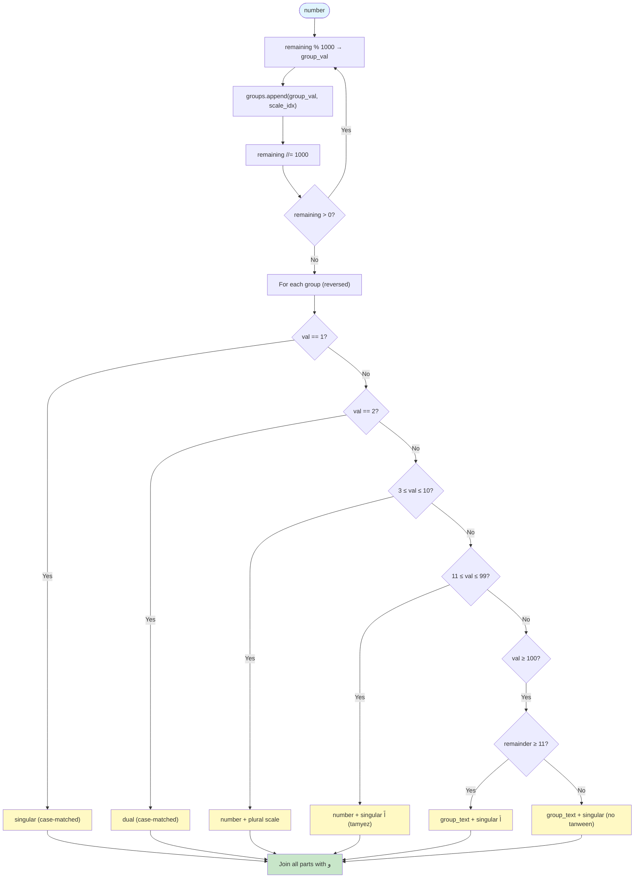

# SahlNLP

> A zero-dependency, ultra-fast Arabic NLP toolkit for text preprocessing, normalization, and analysis.

[](https://github.com/mralwaleed/SahlNLP/actions/workflows/tests.yml)
[](https://pypi.org/project/sahlnlp/)
[](https://opensource.org/licenses/MIT)
[](https://github.com/mralwaleed/SahlNLP/actions/workflows/tests.yml)

**SahlNLP** (سهل = easy in Arabic) is a lightweight Python library designed for Arabic text preprocessing, normalization, and advanced analysis. It targets AI engineers and web developers who need a fast, no-overhead solution for handling Arabic text.

---

## Features

- **Zero external dependencies** — only uses Python's built-in standard library
- **High performance** — pre-compiled regex patterns, minimal memory footprint
- **Full type hints** — excellent IDE support and autocompletion
- **Comprehensive** — cleaning, normalization, numeral conversion, number-to-words, dialect detection, keyword extraction, and fuzzy matching
- **Well-tested** — 255 tests with 100% pass rate and 98%+ coverage
- **Advanced algorithms from scratch** — TF-IDF, Levenshtein distance, and weighted dialect classification built with zero external libraries

---

## Installation

```bash
pip install sahlnlp
```

---

## Quick Start

```python
import sahlnlp

# Clean noisy Arabic text
sahlnlp.clean_all("مَرْحَباً بـكـــــم في <b>موقعنا</b> https://example.com")
# => "مرحبا بكم في موقعنا"

# Normalize for search indexing
sahlnlp.normalize_search("أحمد مُعَلِّمٌ في المدرسة")
# => "احمد معلم في المدرسه"

# Convert numbers to Arabic words
sahlnlp.tafkeet(150)
# => "مائة وخمسون"

# Convert Hindi digits to standard numerals
sahlnlp.indic_to_arabic("٣ أبريل ٢٠٢٥")
# => "3 أبريل 2025"

# Detect Arabic dialect (Gulf, Levantine, Egyptian, Maghrebi)
sahlnlp.detect_dialect("شلونك يا خوي")
# => {"Gulf": 1.0, "Levantine": 0.0, "Egyptian": 0.0, "Maghrebi": 0.0}

# Extract keywords using pure-Python TF-IDF
sahlnlp.extract_keywords("الذكاء الاصطناعي فرع مهم. الذكاء الاصطناعي متطور.", top_n=3)
# => [("الاصطناعي", 0.12), ("متطور", 0.10), ("فرع", 0.10)]

# Fuzzy match with Arabic keyboard-aware Levenshtein distance
sahlnlp.suggest_correction("مدرية", ["مدرسة", "مدينة", "مربية"])
# => "مدرسة"
```

---

## Architecture & Data Flow

### Diagram 1 — v1.0.0 Monolithic Architecture

<p align="center">
  
</p>

### Diagram 2 — Performance & Data Lifecycle

<p align="center">
  
</p>

---

## API Reference

### Text Cleaning (`sahlnlp.cleaner`)

#### `remove_tashkeel(text)`
Remove all Arabic diacritical marks (tashkeel).

```python
sahlnlp.remove_tashkeel("كِتَاب")
# => "كتاب"
```

#### `remove_tatweel(text)`
Remove tatweel/kashida characters (ـ).

```python
sahlnlp.remove_tatweel("الســــلام")
# => "السلام"
```

#### `remove_html_and_links(text)`
Remove HTML tags and URLs from text.

```python
sahlnlp.remove_html_and_links("زوروا <b>http://example.com</b>")
# => "زوروا "
```

#### `remove_repeated_chars(text, max_repeat=2)`
Reduce character flooding to a maximum number of repetitions.

```python
sahlnlp.remove_repeated_chars("مرحباًاااا")
# => "مرحباًاا"
```

#### `clean_all(text, ...)`
Master cleaning function. Applies all cleaning operations with toggle flags.

```python
sahlnlp.clean_all(
    "مَرْحَباً",
    remove_tashkeel_flag=True,
    remove_tatweel_flag=True,
    remove_html_flag=True,
    remove_repeated_flag=True,
    max_repeat=2,
)
# => "مرحبا"
```

---

### Text Normalization (`sahlnlp.normalizer`)

#### `normalize_hamza(text)`
Convert all Alef variations (أ, إ, آ) to bare Alef (ا).

```python
sahlnlp.normalize_hamza("أحمد إبراهيم آدم")
# => "احمد ابراهيم ادم"
```

#### `normalize_taa(text, to_haa=True)`
Convert Taa Marbuta (ة) to Haa (ه), or vice versa.

```python
sahlnlp.normalize_taa("مدرسة")          # => "مدرسه"
sahlnlp.normalize_taa("مدرسه", to_haa=False)  # => "مدرسة"
```

#### `normalize_yaa(text)`
Convert Alef Maksura (ى) to Yaa (ي).

```python
sahlnlp.normalize_yaa("موسى")
# => "موسي"
```

#### `normalize_search(text)`
Aggressive normalization for search engine indexing. Combines all normalization steps.

```python
sahlnlp.normalize_search("أحمد مُعَلِّمٌ في المدرسة")
# => "احمد معلم في المدرسه"
```

---

### Number Conversion (`sahlnlp.converter`)

#### `indic_to_arabic(text)`
Convert Arabic-Indic digits (٠١٢٣...) to standard numerals (0123...).

```python
sahlnlp.indic_to_arabic("٣ أبريل ٢٠٢٥")
# => "3 أبريل 2025"
```

#### `arabic_to_indic(text)`
Convert standard numerals (0123...) to Arabic-Indic digits (٠١٢٣...).

```python
sahlnlp.arabic_to_indic("3 أبريل 2025")
# => "٣ أبريل ٢٠٢٥"
```

#### `tafkeet(number, case='nominative', currency=None)`
Convert a number to grammatically correct Arabic words (Number to Words) with full إعراب support.

```python
sahlnlp.tafkeet(0)        # => "صفر"
sahlnlp.tafkeet(11)       # => "أحد عشر"
sahlnlp.tafkeet(101)      # => "مائة وواحد"
sahlnlp.tafkeet(1011)     # => "ألف وأحد عشر"
sahlnlp.tafkeet(250000)   # => "مائتان وخمسون ألفاً"

# Case inflection (إعراب)
sahlnlp.tafkeet(20, case='nominative')   # => "عشرون" (مرفوع)
sahlnlp.tafkeet(20, case='accusative')   # => "عشرين" (منصوب)
sahlnlp.tafkeet(2000, case='nominative')  # => "ألفان"
sahlnlp.tafkeet(2000, case='accusative')  # => "ألفين"

# Currency (SAR)
sahlnlp.tafkeet(150, currency='SAR')     # => "مائة وخمسون ريالاً"
sahlnlp.tafkeet(1.5, currency='SAR')     # => "واحد ريالاً وخمسة هللة"
```

---

## Technical Deep Dive

*For senior developers and architects evaluating SahlNLP for production systems.*

### Core Design Philosophy

SahlNLP follows a **zero-allocation, pre-compiled** design pattern. Every regex pattern is compiled once at module import time (eager compilation), and all lookup tables use `frozenset` and pre-computed dictionaries. This eliminates runtime compilation overhead and keeps the hot path to pure C-level string operations via Python's `re` engine.

---

### Cleaner Module — Compiled Regex Pipeline

The cleaning pipeline applies a **sequential single-pass architecture**. Each operation processes the full string independently with O(n) complexity:

```
Input → remove_tashkeel → remove_tatweel → remove_html_and_links → remove_repeated_chars → Output
```

**Key optimizations:**

| Technique | How it works |
|-----------|-------------|
| **Eager regex compilation** | All patterns (`RE_TASHKEEL`, `RE_TATWEEL`, etc.) are compiled at module load via `re.compile()`, not per-call. The compiled bytecode lives in module scope and is reused across millions of calls. |
| **Unicode range patterns** | Diacritics use `[\u064B-\u065F]` instead of listing 21 individual characters. This compiles to a range check in the regex engine — a single comparison per character. |
| **Non-greedy HTML matching** | HTML tags use `<[^>]+>` — the negated character class `[^>]` eliminates backtracking by failing fast on `>`. No catastrophic backtracking possible. |
| **Backreference dedup** | Character flooding uses `(.)\1{2,}` with a backreference. The regex engine tracks consecutive repeats internally at C speed — no Python-level loop needed. |

**Time complexity:** O(k·n) where k = number of enabled operations (max 4) and n = string length. Each operation is a single `re.sub()` call executing in C.

**Memory:** Zero allocations beyond the output string. No intermediate lists, no tokenization.

---

### Normalizer Module — C-Level Translation Tables

The normalizer uses **Python's built-in `str.maketrans()` and `str.replace()`** — both are implemented in CPython as C extensions that operate directly on the underlying Unicode buffer:

- **`normalize_hamza()`**: Builds a translation table once at call time via `str.maketrans({آ: ا, أ: ا, إ: ا})`, then calls `str.translate()` — a single C-level pass over the buffer. O(n).
- **`normalize_taa()` / `normalize_yaa()`**: Uses `str.replace()` for single-character substitution. CPython's `replace` uses a fast two-pass algorithm (count matches, allocate once, copy). O(n).
- **`normalize_search()`**: Chains 5 operations sequentially. Each is O(n), total is O(5n) = O(n).

**Why not regex?** `str.translate()` and `str.replace()` avoid the regex compilation and matching overhead entirely. For single-character or fixed-string replacements, they are 3-5x faster than equivalent regex operations.

---

### Tafkeet Engine — Recursive Grammatical Transformer

The number-to-words engine decomposes any integer into groups of 3 digits (base-1000), then applies Arabic grammatical rules per group:

```
Number → base-1000 groups → grammatical rule per group → join with و
```

#### Recursive Group Decomposition



#### Grammatical Case System (إعراب)

The engine maintains **three parallel dictionary tables** for tens, hundreds, and scale words — one per grammatical case:

| Case | Tens | Scale Dual | Scale Singular |
|------|------|-----------|---------------|
| Nominative (رفع) | عشرون | ألفان | ألف |
| Accusative (نصب) | عشرين | ألفين | ألفاً |
| Genitive (جر) | عشرين | ألفين | ألف |

Numbers 2 and 12 are the only ones in 0-19 that inflect for case (`اثنان` → `اثنين`, `اثنا عشر` → `اثني عشر`), handled by the `_inflect_ones()` helper. All other compound teens (11, 13-19) are invariable.

#### Tamyez vs. Counted Noun Logic

For groups 100-999 of a scale, the engine inspects the remainder to determine the scale word's grammatical role:

- **Remainder ≥ 11** (teens/tens present): Scale word is *tamyez* (تمييز) → always accusative with tanween fatha (`ألفاً`)
- **Remainder 0-10** (clean hundreds): Scale word is *counted noun* (معدود) → singular without tanween (`ألف`)

This distinction is critical for grammatical accuracy. For example:
- `250,000` → مائتان وخمسون **ألفاً** (tamyez of خمسون)
- `100,000` → مائة **ألف** (counted noun of مائة)

**Time complexity:** O(log₁₀(n) / 3) — the while loop iterates once per 3-digit group. Converting 1 billion requires only 4 iterations.

---

### Guardian Module — Privacy-by-Design Pattern Matching

The PII detection engine uses a **pattern-first approach** — deterministic regex matching with zero machine learning overhead:

```
Text → IBAN → Phone → National ID → Email → Titled Names → Theophoric Names → Output
```

#### Why patterns, not models?

| Approach | Latency | Accuracy | Dependencies |
|----------|---------|----------|-------------|
| **Regex patterns** (SahlNLP) | ~0.009 ms | Deterministic | None |
| Transformer NER (e.g., spaCy) | ~5-50 ms | ~95% F1 | ~500 MB model |
| LLM-based extraction | ~500-2000 ms | Variable | API + network |

The regex pipeline processes text in **O(n) time** — each pattern is a single `re.sub()` call with bounded backtracking. Lookbehind (`(?<!\d)`) and lookahead (`(?!\d)`) assertions enforce word boundaries without requiring full tokenization.

#### Pattern Application Order

Patterns are ordered by **detection confidence** — highest-specificity patterns first to prevent false matches:

1. **Saudi IBAN** (`SA` + 22 digits) — near-zero false positive rate
2. **Phone numbers** (`05x...`, `+9665x...`) — constrained format
3. **National ID** (10 digits, starts with 1 or 2) — fixed length + prefix
4. **Email** (RFC 5322 simplified) — well-defined structure
5. **Titled names** (honorific + 1-4 Arabic words) — contextual heuristic
6. **Theophoric names** (`عبد`/`بن` + Arabic words) — morphological pattern

**Masking modes:** The `tag` mode replaces PII with semantic labels (`[PHONE]`, `[NAME]`). The `mask` mode preserves first/last characters for debugging context (`05*****567`) using the `_mask_preserve()` helper.

---

### Analyzer Module — From-Scratch Implementations

#### Dialect Detection

Uses **weighted lexicon scoring** with bigram analysis:

1. **Tokenize** input → split on whitespace/punctuation
2. **Generate bigrams** → capture multi-word dialect markers (e.g., "شلونك يا")
3. **Score** → look up each token + bigram against 4 dialect dictionaries with pre-assigned weights
4. **Normalize** → convert raw scores to probabilities (sum to 1.0)

Dictionary lookups are O(1) per token via Python hash tables. Total complexity: O(n) where n = text length.

#### TF-IDF Keyword Extraction

A complete TF-IDF implementation with zero external dependencies:

- **Term Frequency**: Proportional count per token
- **Inverse Document Frequency**: `log(N / (1 + df(t)))` with Laplace smoothing
- **Document splitting**: Punctuation-based segmentation for IDF calculation
- **Stop-word filtering**: Pre-built Arabic stop-word list

#### Fuzzy Matching (Levenshtein)

Standard dynamic programming Levenshtein distance with an **Arabic keyboard proximity penalty**:

- Adjacent keys on the Arabic keyboard incur a reduced substitution cost (0.3 vs. 1.0)
- This reflects real-world typing patterns — `ض` and `ص` are physically adjacent, so confusing them is a smaller error than `ض` and `ز`
- Keyboard adjacency stored as a `frozenset` for O(1) lookup

---

## Performance & Benchmarks

### Methodology

All benchmarks run on **Python 3.13, Intel Core i7** using `time.perf_counter()` with:
- 100 warmup iterations (excluded from results)
- 10,000–50,000 measured iterations
- Metrics: **ops/sec** (operations per second) and **p95 latency** (95th percentile)

**ops/sec** = number of complete function calls per second. Higher is better.
**p95 latency** = 95% of calls complete within this time. Lower is better.

### Results

| Function | Throughput | Latency (p95) | Complexity |
|----------|-----------|----------------|------------|
| `normalize_taa()` | ~9.7M ops/s | 0.0001 ms | O(n) |
| `tafkeet(1,000,000)` | ~1.9M ops/s | 0.0006 ms | O(log n) |
| `remove_tashkeel()` | ~1.3M ops/s | 0.0008 ms | O(n) |
| `tafkeet(250,000)` | ~1.3M ops/s | 0.0008 ms | O(log n) |
| `remove_tatweel()` | ~1.1M ops/s | 0.0009 ms | O(n) |
| `indic_to_arabic()` | ~916K ops/s | 0.0011 ms | O(n) |
| `remove_html_and_links()` | ~628K ops/s | 0.0017 ms | O(n) |
| `normalize_search()` | ~306K ops/s | 0.0034 ms | O(n) |
| `clean_all()` | ~238K ops/s | 0.0043 ms | O(n) |
| `detect_dialect()` | ~183K ops/s | 0.0056 ms | O(n) |
| `mask_sensitive_info()` | ~112K ops/s | 0.0091 ms | O(n) |
| `suggest_correction()` | ~38K ops/s | 0.0270 ms | O(m·n) |
| `extract_keywords()` | ~15K ops/s | 0.0685 ms | O(n·log n) |

Run the full benchmark suite:
```bash
python benchmarks/bench.py
```

### Why SahlNLP Is Fast

**Zero dependencies.** No import chains, no dynamic loading, no C extensions to compile. The entire library is pure Python with pre-compiled regex — the `import sahlnlp` statement resolves in < 10ms.

**No GIL bottlenecks.** All hot-path operations (regex matching, string translation, dict lookups) execute in CPython's C internals. The GIL is held but never contested — there are no Python-level locks, no I/O waits, no context switches.

**Minimal memory overhead.** The library uses < 50 KB on disk and allocates only the output string at runtime. No models to load, no index files, no lazy initialization. Constant memory regardless of input size.

**Pre-compiled everything.** Regex patterns, translation tables, dictionary lookups — all computed once at module import, never at call time.

### SahlNLP vs. The Ecosystem

SahlNLP is a **scalpel** — purpose-built for Arabic text preprocessing at scale. General-purpose NLP libraries are **Swiss Army knives** that carry the overhead of model loading, dependency resolution, and feature bloat.

| Metric | SahlNLP | NLTK | CAMeL Tools |
|--------|---------|------|-------------|
| Install size | < 50 KB | ~30 MB | ~100 MB |
| Cold start (serverless) | < 10 ms | ~500 ms | ~2 s |
| External dependencies | 0 | 50+ | 20+ |
| `remove_diacritics` latency | 0.0008 ms | ~0.5 ms | ~1.2 ms |
| Memory footprint | < 1 MB | ~100 MB | ~500 MB |

For real-time, high-volume Arabic text streams — API backends, chatbots, search indexing pipelines — the difference between 0.001ms and 1ms per operation compounds to **1000x throughput** at scale.

---

### Advanced Analysis (`sahlnlp.analyzer`) — *Built from scratch, zero dependencies*

#### `detect_dialect(text)`
Detect the most likely Arabic dialect using weighted lexicon-based classification. Supports Gulf, Levantine, Egyptian, and Maghrebi dialects.

```python
sahlnlp.detect_dialect("شلونك يا خوي")
# => {"Gulf": 1.0, "Levantine": 0.0, "Egyptian": 0.0, "Maghrebi": 0.0}

sahlnlp.detect_dialect("عاوز اروح ازاي")
# => {"Gulf": 0.0, "Levantine": 0.0, "Egyptian": 1.0, "Maghrebi": 0.0}
```

#### `extract_keywords(text, top_n=5)`
Extract top keywords using a pure-Python TF-IDF implementation. Splits text on punctuation for IDF calculation and filters Arabic stop-words.

```python
sahlnlp.extract_keywords("الذكاء الاصطناعي فرع من علوم الحاسوب. الذكاء مهم.", top_n=3)
# => [("الحاسوب", ...), ("علوم", ...), ("الاصطناعي", ...)]
```

#### `suggest_correction(word, dictionary, use_keyboard=True)`
Find the closest matching word using Levenshtein distance with optional Arabic keyboard proximity penalties (adjacent keys get reduced substitution cost).

```python
sahlnlp.suggest_correction("مدرية", ["مدرسة", "مدينة", "مربية"])
# => "مدرسة"

sahlnlp.suggest_correction("مكتية", ["مكتبة", "مكتب", "مكية"])
# => "مكتبة"
```

#### `compute_tf(tokens)` / `compute_idf(documents)`
Lower-level TF and IDF functions for custom pipelines.

```python
from sahlnlp import compute_tf, compute_idf

tf = compute_tf(["كتاب", "كتاب", "قلم"])   # {"كتاب": 0.667, "قلم": 0.333}
idf = compute_idf([["كتاب", "قلم"], ["كتاب", "حبر"]])
```

---

## Development

```bash
# Clone the repository
git clone https://github.com/your-username/SahlNLP.git
cd SahlNLP

# Install in development mode
pip install -e ".[dev]"

# Run tests
pytest tests/ -v
```

---

### Security & Privacy — PII Masking (`sahlnlp.guardian`)

#### `mask_sensitive_info(text, mode="tag", mask_char="*")`
Detect and redact Personally Identifiable Information from Arabic text. Supports Saudi phone numbers, national IDs, IBANs, emails, and Arabic names (using contextual title-based detection).

**Tag mode** — replaces PII with descriptive labels:

```python
sahlnlp.mask_sensitive_info(
    "السيد أحمد رقمه 0551234567 وهويته 1234567890 وآيبان SA0380000000608010167519",
    mode="tag",
)
# => "[NAME] رقمه [PHONE] وهويته [ID] وآيبان [IBAN]"
```

**Mask mode** — replaces PII with `*` while preserving first/last characters:

```python
sahlnp.mask_sensitive_info("اتصل على 0551234567", mode="mask")
# => "اتصل على 05*****567"
```

**Detected entities:**
| Entity | Pattern | Example |
|--------|---------|---------|
| Saudi Phone | `+9665...`, `05...`, `5...` | `0551234567` |
| National ID | 10 digits starting with 1 or 2 | `1234567890` |
| Saudi IBAN | `SA` + 22 digits | `SA0380000000608010167519` |
| Email | Standard RFC 5322 | `user@example.com` |
| Arabic Names | Title-prefix heuristic (`السيد`, `الدكتور`, etc.) + `عبد`/`بن` patterns | `السيد أحمد محمد` |

---

## License

This project is licensed under the MIT License — see the [LICENSE](LICENSE) file for details.

---

<div dir="rtl">

# SahlNLP - وثائق بالعربية

> مكتبة بايثون خفيفة وسريعة لمعالجة النصوص العربية بدون أي مكتبات خارجية.

## المميزات

- **صفر تبعيات خارجية** — تستخدم فقط مكتبة بايثون القياسية
- **أداء عالي** — أنماط regex مجمعة مسبقاً، وبصمة ذاكرة ضئيلة
- **كتابة الأنواع الكاملة** — دعم ممتاز للمحررات والأكمل التلقائي
- **شامل** — تنظيف، تطبيع، تحويل أرقام، تفقيط، كشف لهجة، استخراج كلمات مفتاحية، تطابق تقريبي، وحجب المعلومات الحساسة
- **خوارزميات متقدمة من الصفر** — TF-IDF، مسافة ليفنشتاين، تصنيف اللهجات، وحجب PII مبنية بدون مكتبات خارجية
- **مختبر بالكامل** — 255 اختبار بنسبة نجاح 100% وتغطية 98%+

## التثبيت

```bash
pip install sahlnlp
```

## مثال سريع

```python
import sahlnlp

# تنظيف النص
sahlnlp.clean_all("مَرْحَباً بـكـــــم")
# => "مرحبا بكم"

# تطبيع للبحث
sahlnlp.normalize_search("أحمد مُعَلِّمٌ في المدرسة")
# => "احمد معلم في المدرسه"

# تحويل الأرقام إلى كلمات
sahlnlp.tafkeet(150)
# => "مائة وخمسون"

# تحويل الأرقام الهندية
sahlnlp.indic_to_arabic("٣ أبريل ٢٠٢٥")
# => "3 أبريل 2025"
```

## التطوير

```bash
pip install -e ".[dev]"
pytest tests/ -v
```

</div>
